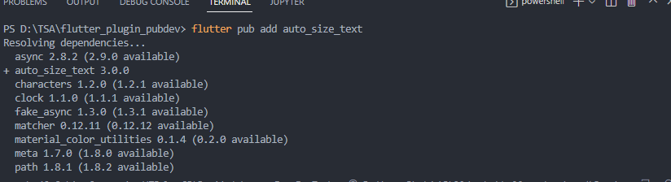
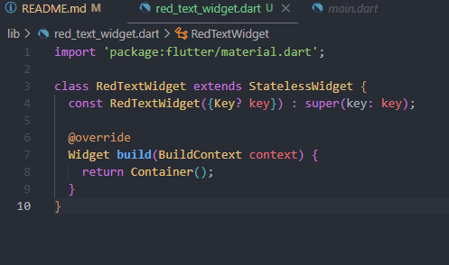
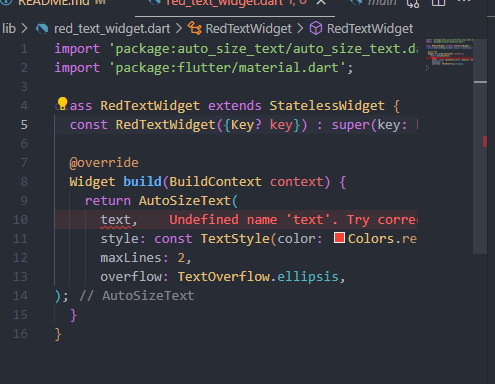
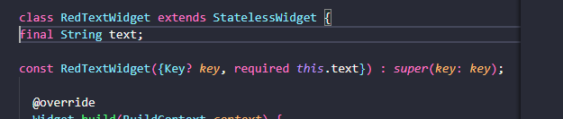
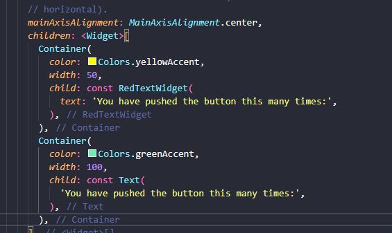
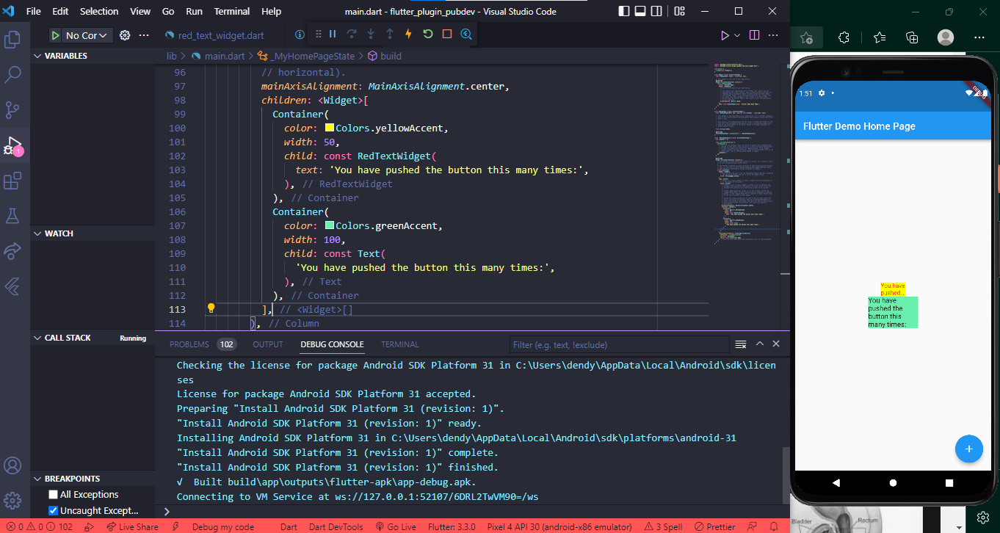

# Praktikum Menerapkan Plugin di Project Flutter
Selesaikan langkah-langkah praktikum berikut ini menggunakan editor Visual Studio Code (VS Code) atau Android Studio atau code editor lain kesukaan Anda.

Perhatian: Diasumsikan Anda telah berhasil melakukan setup environment Flutter SDK, VS Code, Flutter Plugin, dan Android SDK pada pertemuan pertama.

# Langkah 1: Buat Project Baru
Buatlah sebuah project flutter baru dengan nama flutter_plugin_pubdev. Lalu jadikan repository di GitHub Anda dengan nama flutter_plugin_pubdev.

# Langkah 2: Menambahkan Plugin
Tambahkan plugin auto_size_text menggunakan perintah berikut di terminal

Jika berhasil, maka akan tampil nama plugin beserta versinya di file pubspec.yaml pada bagian dependencies.

# Langkah 3: Buat file red_text_widget.dart
Buat file baru bernama red_text_widget.dart di dalam folder lib lalu isi kode seperti berikut.

# Langkah 4: Tambah Widget AutoSizeText
Masih di file red_text_widget.dart, untuk menggunakan plugin auto_size_text, ubahlah kode return Container() menjadi seperti berikut.

mengapa error tersebut terjadi karena pada code ini kita belum mendeklarasikan variabel pada text, dan parameter constructor pada redtextwidget

# Langkah 5: Buat Variabel text dan parameter di constructor
Tambahkan variabel text dan parameter di constructor seperti berikut.

# Langkah 6: Tambahkan widget di main.dart
Buka file main.dart lalu tambahkan di dalam children: pada class _MyHomePageState

Result

8. Tugas Praktikum
2. Jelaskan maksud dari langkah 2 pada praktikum tersebut!
Pada langkah tersebut kita menambhakan sebuah plugin untuk flutter
3. Jelaskan maksud dari langkah 5 pada praktikum tersebut!
dalam itu kita membuat sebuah insialisasi variabel final agar bisa digunakan, serta kita membuat constructor pada Redtextwidget
4. Pada langkah 6 terdapat dua widget yang ditambahkan, jelaskan fungsi dan perbedaannya!
Pada sample code bagian atas kita memamanggil sebuah class yang telah dibuat berfungsi unutuk menambahkan style pad atext, yang sample code kedua memanggil widget text langsung
5. Jelaskan maksud dari tiap parameter yang ada di dalam plugin auto_size_text berdasarkan tautan pada dokumentasi ini !
parameter yang ada didalam plugin tersebut ada pertama style untuk mengubah atau menyesuaikan gaya font warna dll, kedua maxline dimana ini adalah max dari garis sehingga mauto menyesuaikan saat 2 garis, yang trakhir ada overflow ini menjadikan jika tulisan melebihi ketentuan maka tidak ditampilkan hanya menampilkan ...
6. Kumpulkan laporan praktikum Anda berupa link repository GitHub ke LMS!